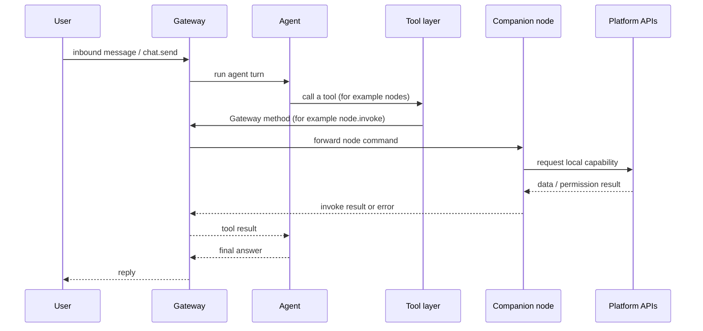
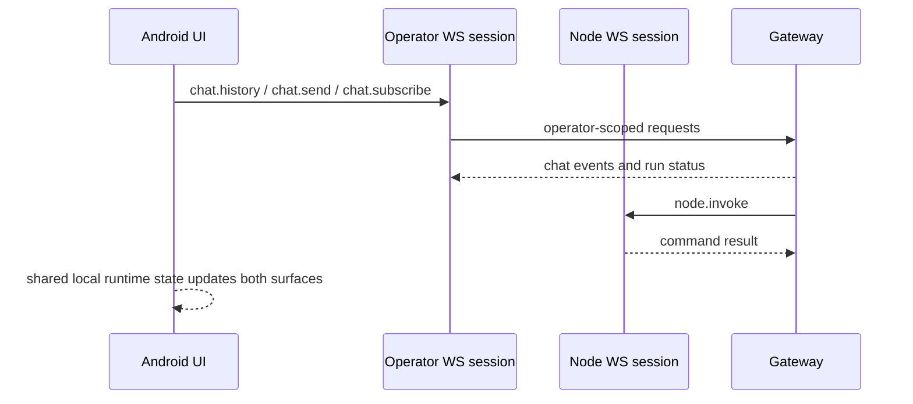
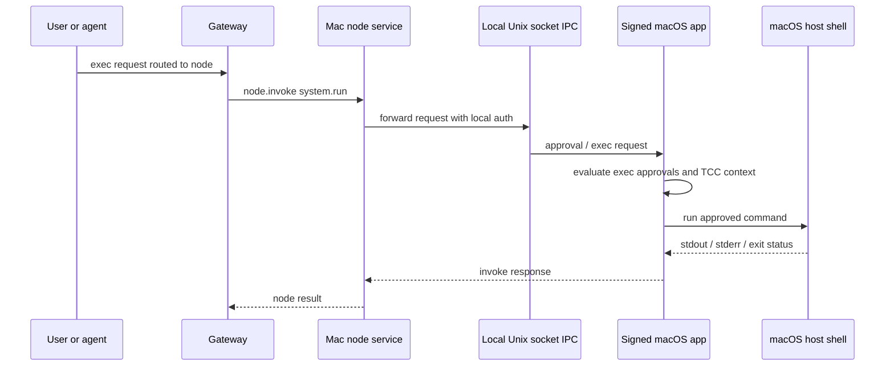
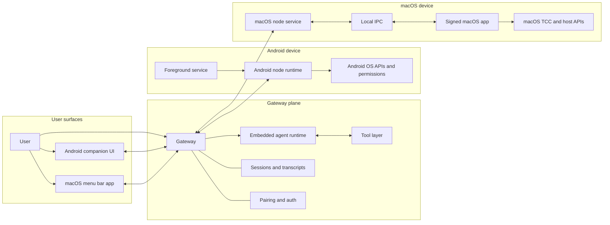
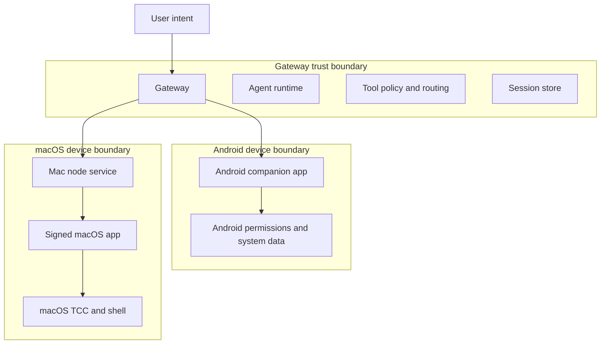

# Companion App Architecture

This page is a v1 research summary for the **macOS** and **Android** companion apps.
Its goal is to answer four recurring questions clearly:

1. What is the companion app responsible for?
2. Is it just a UI shell, or does it also act as a permission broker, capability proxy, or node host?
3. What is shared across macOS and Android, and what differs?
4. Which companion capabilities are high risk?

Related references:

- [Platforms](/platforms)
- [macOS App](/platforms/macos)
- [Android App](/platforms/android)
- [Nodes](/nodes/index)
- [Gateway Protocol](/gateway/protocol)
- [Agent Runtime](/concepts/agent)
- [macOS IPC](/platforms/mac/xpc)
- [macOS Permissions](/platforms/mac/permissions)

## Executive summary

The companion app is **not** just a UI shell.

- On **Android**, the companion app is a **combined operator UI + node runtime + permission broker + capability proxy**. It talks to the Gateway twice over WebSocket: once as an **operator** client for chat/control features, and once as a **node** client that advertises device capabilities and handles `node.invoke` commands.
- On **macOS**, the companion app is a **menu bar UI + gateway lifecycle broker + permission broker + node capability host**. In local mode it also manages the local Gateway lifecycle. In remote mode it acts as a local capability endpoint for a remote Gateway. It additionally brokers `system.run` through the signed app context and local IPC.
- In both platforms, the **Gateway** remains the system authority for sessions, agent runs, tool routing, pairing, and policy. Companions do **not** replace the Gateway.
- The **agent** runs on the Gateway. The agent uses **tools**. Some of those tools ultimately resolve to **node** commands. The companion app is one concrete implementation of a node.

A practical shorthand:

- **Gateway** = authority, session store, policy engine, tool router, agent host.
- **Agent** = model-driven decision-maker running inside the Gateway.
- **Tool** = agent-callable abstraction.
- **Node** = remotely invokable capability host attached to the Gateway.
- **Companion app** = a platform-native app that may act as UI, operator client, permission broker, and node implementation at the same time.

## Core terms and relationships

## Gateway

The Gateway is the always-on control plane. It owns:

- WebSocket and HTTP entrypoints
- device pairing and device-issued auth tokens
- session and transcript storage
- agent execution
- tool exposure and routing
- node registration and `node.invoke` forwarding

The Gateway is the source of truth for sessions and agent runs. Companion apps connect to it; they do not become it.

## Agent

The agent is the embedded model runtime that the Gateway runs for a session. It:

- receives session context and system prompt inputs
- decides whether to answer directly or call tools
- streams tool activity and replies back through the Gateway

The agent does **not** run inside the Android or macOS companion apps.

## Tool

A tool is an agent-facing abstraction such as `nodes`, `browser`, `exec`, or session tools.

Important boundary:

- A tool is **not** necessarily implemented on the same machine as the Gateway.
- For node-backed capabilities, the Gateway-side tool call is translated into a Gateway method such as `node.invoke`, then forwarded to the selected node.

## Node

A node is a capability host that connects to the Gateway with `role: "node"` and advertises:

- `caps`: high-level capability families
- `commands`: exact invokable commands
- `permissions`: coarse-grained permission state hints

The companion apps are node implementations for their respective platforms.

## Companion app

A companion app is the native endpoint that owns platform APIs and permissions.

Depending on platform, it can simultaneously be:

- a user-facing UI
- an operator client connected with `role: "operator"`
- a node connected with `role: "node"`
- a permission broker for OS-protected resources
- a capability proxy that translates node commands into platform API calls
- a lifecycle broker for local services or IPC

## Responsibilities by platform

| Area                                         | Android companion                                          | macOS companion                                                 |
| -------------------------------------------- | ---------------------------------------------------------- | --------------------------------------------------------------- |
| Operator UI                                  | Yes                                                        | Yes                                                             |
| Node runtime                                 | Yes                                                        | Yes                                                             |
| Gateway host                                 | No                                                         | Sometimes; local mode manages/attaches to a local Gateway       |
| Permission broker                            | Yes                                                        | Yes                                                             |
| Capability proxy                             | Yes                                                        | Yes                                                             |
| `system.run` host                            | No                                                         | Yes                                                             |
| Local IPC broker                             | No meaningful extra IPC layer beyond app/runtime internals | Yes; node service ↔ app Unix socket for exec and approvals      |
| Foreground service / launch agent management | Yes; foreground service keeps node connection alive        | Yes; launchd management for Gateway and node service            |
| Remote mode support                          | Connects to remote/local Gateway                           | Connects to remote Gateway and exposes this Mac as a local node |

## What the companion app is not

In both platforms, the companion app is **not**:

- the source of truth for session transcripts
- the primary policy engine for tool exposure
- the model runtime host for normal agent runs
- a standalone replacement for the Gateway

## Shared architecture across macOS and Android

Both companion apps follow the same top-level pattern:

1. discover or configure a Gateway endpoint
2. authenticate and pair as a device
3. open a WebSocket **operator** connection for UI/chat control
4. open a WebSocket **node** connection for platform capabilities
5. advertise capability claims to the Gateway
6. receive `node.invoke` requests from the Gateway
7. map those requests to local platform APIs
8. return results, media blobs, or structured errors

Common traits:

- both are **Gateway-attached clients**, not standalone runtimes
- both expose a **node command surface**
- both own the **OS permission prompts** for their platform
- both are part of the control plane from the user’s perspective
- both can be queried or driven through Gateway-level node tooling

## Key platform differences

### Android

Android behaves like a **mobile node-first companion**.

- It never hosts the Gateway.
- It keeps the node connection alive with a **foreground service**.
- It exposes a wider set of **personal device data** commands, including notifications, photos, contacts, calendar, motion, SMS, and call log depending on build flavor, hardware, and granted permissions.
- Many interactive media capabilities are **foreground-only**.
- It maintains both operator and node sessions from the app runtime.

### macOS

macOS behaves like a **desktop broker companion**.

- In local mode, it manages or attaches to the local Gateway.
- In remote mode, it exposes local Mac capabilities to a remote Gateway.
- It owns a privileged bridge for `system.run` and exec approvals.
- It also exposes desktop-centric capabilities like screen recording and optional browser proxying.
- It uses a dedicated local IPC path between the headless node service and the signed app bundle for TCC-sensitive operations.

## Platform capability inventory

## Android companion capability families

Android advertises these capability families when available:

- `canvas`
- `device`
- `notifications`
- `system`
- `camera`
- `sms`
- `voiceWake` (currently effectively off in runtime/UX)
- `location`
- `photos`
- `contacts`
- `calendar`
- `motion`
- `callLog`

### Android node commands

Always or commonly available:

- Canvas: `canvas.present`, `canvas.hide`, `canvas.navigate`, `canvas.eval`, `canvas.snapshot`, `canvas.a2ui.push`, `canvas.a2ui.pushJSONL`, `canvas.a2ui.reset`
- Device: `device.status`, `device.info`, `device.permissions`, `device.health`
- Notifications: `notifications.list`, `notifications.actions`
- System: `system.notify`
- Photos: `photos.latest`
- Contacts: `contacts.search`, `contacts.add`
- Calendar: `calendar.events`, `calendar.add`

Conditional on settings, permissions, hardware, or build flavor:

- Camera: `camera.list`, `camera.snap`, `camera.clip`
- Location: `location.get`
- Motion: `motion.activity`, `motion.pedometer`
- SMS: `sms.send`, `sms.search`
- Call log: `callLog.search`

Android capability exposure is dynamic. The app computes current commands and capabilities based on user settings, build flavor, hardware support, and runtime permission state.

## macOS companion capability families

macOS advertises these capability families when available:

- `canvas`
- `screen`
- `browser` (optional)
- `camera` (user toggle)
- `location` (user toggle)

The macOS node also exposes system commands even though those are better thought of as a privileged command surface than as a separate capability family:

- `system.run`
- `system.which`
- `system.notify`
- `system.execApprovals.get`
- `system.execApprovals.set`

### macOS node commands

Always or commonly available:

- Canvas: `canvas.present`, `canvas.hide`, `canvas.navigate`, `canvas.eval`, `canvas.snapshot`, `canvas.a2ui.push`, `canvas.a2ui.pushJSONL`, `canvas.a2ui.reset`
- Screen: `screen.record`
- System: `system.notify`, `system.which`, `system.run`, `system.execApprovals.get`, `system.execApprovals.set`

Conditional:

- Browser proxy: `browser.proxy`
- Camera: `camera.list`, `camera.snap`, `camera.clip`
- Location: `location.get`

macOS also reports a `permissions` map so the Gateway and agents can reason about current availability before invoking sensitive commands.

## Permissions and system capability mapping

## Android permissions and system surfaces

| Area                    | Main Android permission or system gate                                             | Notes                                                    |
| ----------------------- | ---------------------------------------------------------------------------------- | -------------------------------------------------------- |
| Gateway networking      | `INTERNET`, `ACCESS_NETWORK_STATE`                                                 | Baseline connectivity                                    |
| Discovery               | `NEARBY_WIFI_DEVICES` on newer Android, location-backed discovery on older Android | Network discovery surface                                |
| Foreground node service | `FOREGROUND_SERVICE`, `FOREGROUND_SERVICE_DATA_SYNC`, `POST_NOTIFICATIONS`         | Needed to keep node connected with visible notification  |
| Camera photo/video      | `CAMERA`                                                                           | Required for `camera.snap` and `camera.clip`             |
| Camera video with audio | `RECORD_AUDIO`                                                                     | Required when recording audio with clips                 |
| Location                | `ACCESS_FINE_LOCATION`, `ACCESS_COARSE_LOCATION`                                   | Android node currently supports foreground location mode |
| Notifications read/act  | Notification listener service grant + notifications permission on newer Android    | High-sensitivity personal data surface                   |
| Photos                  | `READ_MEDIA_IMAGES` or legacy storage permission                                   | User media access                                        |
| Contacts                | `READ_CONTACTS`, `WRITE_CONTACTS`                                                  | Read and add contacts                                    |
| Calendar                | `READ_CALENDAR`, `WRITE_CALENDAR`                                                  | Read and create events                                   |
| Motion                  | `ACTIVITY_RECOGNITION`                                                             | Activity and pedometer features                          |
| SMS                     | `SEND_SMS`, `READ_SMS`                                                             | Restricted on Google Play                                |
| Call log                | `READ_CALL_LOG`                                                                    | Restricted on Google Play                                |

## macOS permissions and system surfaces

| Area                     | Main macOS gate                   | Notes                                                      |
| ------------------------ | --------------------------------- | ---------------------------------------------------------- |
| Notifications            | UserNotifications authorization   | Used for native notifications and `system.notify` behavior |
| Accessibility            | TCC Accessibility                 | Relevant for automation-related desktop control surfaces   |
| Screen recording         | TCC Screen Recording              | Required for `screen.record` and some capture flows        |
| Microphone               | TCC Microphone                    | Needed for voice and camera clip audio                     |
| Speech recognition       | TCC Speech Recognition            | Needed for voice wake and talk features                    |
| Camera                   | TCC Camera                        | Needed for `camera.snap` and `camera.clip`                 |
| Location                 | Core Location authorization       | Needed for `location.get`                                  |
| AppleScript / Automation | Apple Events / automation consent | Relevant to automation surfaces owned by the app           |

### Permission-broker conclusion

On both platforms, the companion app is the **permission broker** because it is the code-signing and process context that the OS trusts to request and hold these grants.

That is why the companion app cannot be reduced to a thin front-end shell.

## Typical call chains

## Call chain A: agent uses a node capability

This is the standard pattern for Android and most macOS node features.

Interpretation:

- the companion app is the **capability endpoint**
- the Gateway is still the **tool router and policy authority**
- the agent never calls platform APIs directly

## Call chain B: Android app as operator UI + node

Android keeps two Gateway relationships alive in one app runtime.

Interpretation:

- Android is not just a viewer
- it is both a **control-plane client** and a **capability host**

## Call chain C: macOS remote `system.run`

This is the most important macOS-specific chain.

Interpretation:

- macOS uses the companion app as a **privileged execution broker**
- this is stronger than a normal capability proxy and is a major trust boundary

## System architecture diagram v1

## Trust boundary diagram v1

## Trust-boundary interpretation

### Boundary 1: Gateway versus companion

The Gateway trusts node claims only as **claims**, not as absolute truth. It still applies server-side policy before routing commands.

### Boundary 2: companion versus OS-protected resources

The companion app crosses into the OS trust domain when it accesses:

- camera
- microphone
- location
- notifications
- photos
- contacts
- calendar
- SMS
- call log
- screen recording
- shell execution on macOS

This is the main place where privacy and data-exfiltration risk appears.

### Boundary 3: macOS node service versus signed app

On macOS, `system.run` is intentionally split so a headless node service does not directly own all privileged behavior. The signed app remains the TCC-facing authority.

## Capability, permission, and risk matrix v1

| Platform | Capability       | Representative commands                                               | Main permission or gate                       | Risk     | Why                                                       |
| -------- | ---------------- | --------------------------------------------------------------------- | --------------------------------------------- | -------- | --------------------------------------------------------- |
| Android  | Canvas           | `canvas.navigate`, `canvas.eval`, `canvas.snapshot`, `canvas.a2ui.*`  | Foreground app state                          | Medium   | Can expose on-screen data and enable UI-state observation |
| Android  | Camera           | `camera.list`, `camera.snap`, `camera.clip`                           | `CAMERA`, `RECORD_AUDIO` for clip audio       | High     | Captures real-world surroundings, documents, and audio    |
| Android  | Location         | `location.get`                                                        | Coarse/fine location, foreground availability | High     | Real-time personal location and movement                  |
| Android  | Notifications    | `notifications.list`, `notifications.actions`                         | Notification listener service                 | High     | Reads private inbound content and can trigger actions     |
| Android  | Photos           | `photos.latest`                                                       | Media read permission                         | High     | Exposes personal image library content                    |
| Android  | Contacts         | `contacts.search`, `contacts.add`                                     | Contacts permissions                          | High     | Reads and writes address-book data                        |
| Android  | Calendar         | `calendar.events`, `calendar.add`                                     | Calendar permissions                          | High     | Reads schedule and can create events                      |
| Android  | Motion           | `motion.activity`, `motion.pedometer`                                 | Activity recognition                          | Medium   | Behavioral profiling, lower direct exfiltration value     |
| Android  | SMS              | `sms.send`, `sms.search`                                              | `SEND_SMS`, `READ_SMS`                        | Critical | Reads private messages and can send external messages     |
| Android  | Call log         | `callLog.search`                                                      | `READ_CALL_LOG`                               | High     | Exposes calling history and relationships                 |
| Android  | Device           | `device.status`, `device.info`, `device.permissions`, `device.health` | Baseline app/device access                    | Medium   | Inventory and telemetry surface                           |
| Android  | System notify    | `system.notify`                                                       | Notification posting                          | Low      | Mostly local notification output                          |
| macOS    | Canvas           | `canvas.present`, `canvas.eval`, `canvas.snapshot`, `canvas.a2ui.*`   | App toggle, UI context                        | Medium   | Exposes visible UI content and interactive browser state  |
| macOS    | Browser proxy    | `browser.proxy`                                                       | App config toggle, local control endpoint     | High     | Can drive browser-like actions and return files           |
| macOS    | Camera           | `camera.list`, `camera.snap`, `camera.clip`                           | Camera and mic TCC                            | High     | Captures environment and optional audio                   |
| macOS    | Location         | `location.get`                                                        | Location authorization                        | High     | Sensitive physical location data                          |
| macOS    | Screen           | `screen.record`                                                       | Screen Recording TCC                          | Critical | Can capture passwords, messages, and work content         |
| macOS    | System notify    | `system.notify`                                                       | Notification permission state                 | Low      | Local output only                                         |
| macOS    | System discovery | `system.which`                                                        | Exec policy                                   | Medium   | Useful for reconnaissance on host capabilities            |
| macOS    | System execution | `system.run`                                                          | Exec approvals, local IPC, host shell         | Critical | Arbitrary command execution on the Mac                    |
| macOS    | Exec approvals   | `system.execApprovals.get`, `system.execApprovals.set`                | Local approval store                          | Critical | Changes future execution trust policy                     |

## High-risk capability shortlist

These are the surfaces that deserve the most design review, approval hardening, and operator clarity.

### Critical

- Android `sms.send`
- Android `sms.search`
- macOS `screen.record`
- macOS `system.run`
- macOS `system.execApprovals.set`

### High

- Android notifications access and notification actions
- Android photos, contacts, calendar, location, call log
- Android camera and mic-backed capture
- macOS browser proxy
- macOS camera and location

### Medium but easy to underestimate

- Canvas snapshot and browser-like surfaces
- Device metadata and health inventory
- Motion history or behavioral telemetry
- `system.which` for host reconnaissance on macOS

## Design conclusions

## 1) Companion responsibility

The companion app’s job is to bridge the Gateway’s abstract agent/tool world to real platform capabilities.

That means its responsibilities include:

- presenting native UI
- establishing Gateway connectivity
- authenticating and pairing as a device
- owning OS permission prompts
- advertising node capability claims
- executing node commands against local platform APIs
- returning structured results and errors

## 2) UI shell versus broker versus node host

The best answer is:

- **Android companion** = UI shell **plus** permission broker **plus** capability proxy **plus** node runtime
- **macOS companion** = UI shell **plus** gateway lifecycle broker **plus** permission broker **plus** node capability host **plus** privileged exec broker

So the companion app is **far more than a UI shell** on both platforms.

## 3) Commonality versus difference

Commonality:

- both are Gateway-connected native clients
- both expose node capabilities
- both own permission-granting UX
- both are used indirectly by agents through Gateway tool routing

Difference:

- Android is centered on **mobile device data and sensors**
- macOS is centered on **desktop control, screen capture, and local command execution**
- macOS can also manage or attach to the Gateway itself; Android cannot

## 4) Security posture implication

The highest-risk question is not “does the companion have UI?”
It is “which local powers can the Gateway route into this device, under what policy, with what approvals, and with what user visibility?”

That framing is the right way to review companion changes.
