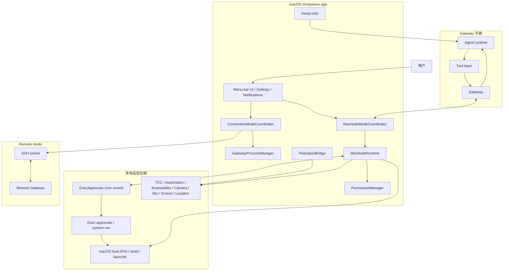
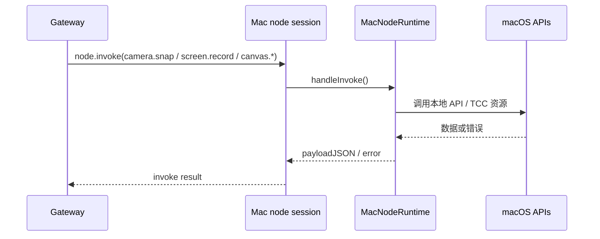
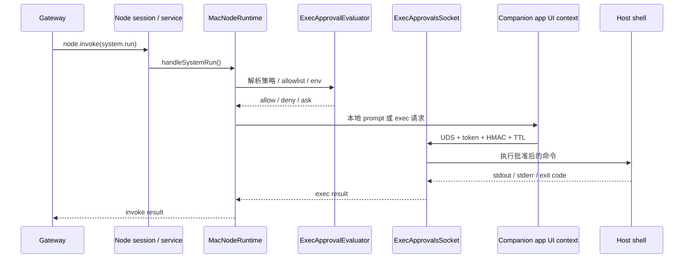
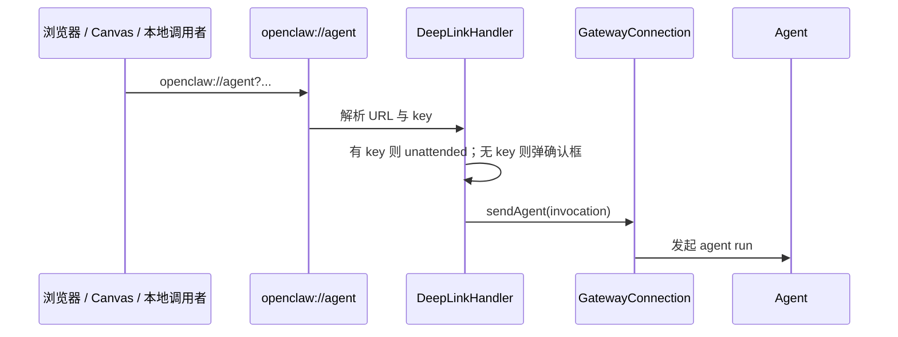

# macOS Companion 安全分析

> 本文是一个**中文、偏安全视角**的设计分析文档。
> 它不是协议规范，也不是实现真理；它的目标是帮助审查者在看 `apps/macos` 代码时，快速建立“组件职责、信任边界、攻击面、风险排序、设计取舍”的整体模型。

相关文档：

- [macOS App](/platforms/macos)
- [macOS IPC](/platforms/mac/xpc)
- [macOS Permissions](/platforms/mac/permissions)
- [Gateway on macOS](/platforms/mac/bundled-gateway)
- [Gateway Protocol](/gateway/protocol)
- [Nodes](/nodes/index)

## 一句话结论

macOS companion app **绝对不是一个单纯的 UI 外壳**。

它同时承担了至少五种角色：

1. **本地控制台 UI**：菜单栏、设置、状态、权限提示、通知。
2. **Gateway 生命周期 broker**：在 local mode 下管理/附着本地 Gateway，在 remote mode 下禁止本地 Gateway。
3. **Node capability host**：把 macOS 的 Canvas、Camera、Screen、Location、Browser、System 能力暴露给 Gateway。
4. **权限 broker**：统一承接 TCC / Automation / Accessibility / Screen Recording / Microphone / Speech / Camera / Location 这些系统授权。
5. **高权限执行 broker**：把最敏感的 `system.run` 从 node service 重新导向签名 GUI app，通过本地 Unix socket、token、HMAC、TTL、同 UID 校验和 exec approval 策略进行二次约束。

因此，macOS companion 本质上是一个**高信任本地代理**：
它把 Gateway 的抽象控制平面翻译成这个 Mac 上真实的系统操作。

## 为什么它要这样设计

从代码与文档看，设计目标非常明确：

- **TCC-facing 能力必须集中到签名 GUI app**，否则权限弹窗、权限持久化、权限稳定性都会变差。
- **Gateway 与本地高权限操作要解耦**，这样 remote mode 下可以把“远端编排”与“本地执行”分开。
- **最危险的能力不能直接暴露给 headless node service**，而是要经过 companion app 的本地策略和用户确认。
- **local mode 和 remote mode 必须显式分开**，避免一台 Mac 同时误跑本地 Gateway 和远端 tunnel，导致混乱的信任模型。

从安全角度看，这些目标都很合理：它们是在“可用性”和“最小暴露”之间做平衡。

## 代码视角下的关键组件

| 组件                      | 关键文件                                                                                | 主要职责                                                                                              | 安全意义                                            |
| ------------------------- | --------------------------------------------------------------------------------------- | ----------------------------------------------------------------------------------------------------- | --------------------------------------------------- |
| 连接模式编排              | `ConnectionModeCoordinator.swift`                                                       | 切 local / remote / unconfigured，决定是否启动本地 Gateway、node service、SSH tunnel、control channel | 决定本机当前信任模型                                |
| 本地 Gateway 管理         | `GatewayProcessManager.swift`, `GatewayLaunchAgentManager.swift`                        | 附着已有 Gateway，或通过 launchd 启停本地 Gateway                                                     | 避免重复进程，限制 remote mode 下误启动本地 Gateway |
| macOS node 注册与命令暴露 | `NodeMode/MacNodeModeCoordinator.swift`                                                 | 计算 caps / commands / permissions 并以 `role:"node"` 连到 Gateway                                    | 决定 Gateway 能看到哪些本地能力                     |
| macOS node 命令实现       | `NodeMode/MacNodeRuntime.swift`                                                         | 真正处理 `canvas.*`、`camera.*`、`screen.record`、`location.get`、`system.*`                          | 这是最核心的能力落点                                |
| exec policy 计算          | `ExecApprovalEvaluation.swift`, `ExecHostRequestEvaluator.swift`, `ExecApprovals.swift` | 解析 allowlist / ask / deny / auto-allow-skills / env 过滤                                            | 是 `system.run` 的核心边界                          |
| 本地 exec IPC             | `ExecApprovalsSocket.swift`                                                             | Unix socket、peer UID、token、HMAC、TTL、prompt server                                                | 是本地高权限桥的真正守门点                          |
| 深链                      | `DeepLinks.swift`                                                                       | 处理 `openclaw://agent`                                                                               | 是本地 URL scheme 入口攻击面                        |
| 远端 tunnel               | `RemoteTunnelManager.swift`, `RemotePortTunnel.swift`                                   | SSH 端口转发，把 remote Gateway 映射到本地                                                            | 是 remote mode 的网络桥                             |
| 浏览器代理                | `NodeMode/MacNodeBrowserProxy.swift`                                                    | 把 node 命令转成对本地 browser control endpoint 的 HTTP 请求                                          | 是另一个高风险代理面                                |
| 系统权限                  | `PermissionManager.swift`                                                               | 聚合 TCC / Accessibility / AppleScript / Speech / Location 等状态与请求                               | companion 作为 permission broker 的证据             |
| PeekabooBridge            | `PeekabooBridgeHostCoordinator.swift`                                                   | 暴露 UI 自动化 socket                                                                                 | 是一个额外且高权限的自动化攻击面                    |

## 设计结构图 v1

## 设计中的核心安全判断

## 1. companion 必须是 TCC authority

macOS 的权限不是“给功能”的，而是“给特定签名 app / bundle id / 路径”的。

这意味着：

- Camera、Mic、Screen Recording、Apple Events、Accessibility 等权限，需要由**稳定签名、固定路径**的 GUI app 来承接。
- 如果把这些能力交给随意拉起的子进程或无签名辅助进程，权限体验和持久性都会变差。
- 这也是为什么 `system.run` 没有直接放在一个 headless node service 里跑，而是被重新 broker 回 companion app。

## 2. local mode / remote mode 是两种不同的信任模型

### local mode

在 local mode 下：

- companion app 会附着或启用本地 Gateway；
- 本机既是 UI 端，也是本地能力提供者；
- 风险集中在“本地 agent 能驱动这个 Mac 做什么”。

### remote mode

在 remote mode 下：

- companion app 不启动本地 Gateway；
- 它通过 SSH tunnel 把远端 Gateway 映射到本机；
- 本机 node service 再把本机能力暴露给远端 Gateway。

安全含义：

- 一旦 remote Gateway 被攻破，攻击者看到的不是“一个普通前端”，而是**一台可被远程编排的 macOS capability host**。
- 所以 remote mode 的安全前提，不只是 SSH 本身安全，还包括远端 Gateway 的整体安全性。

## 3. `system.run` 是被特别隔离出来的高风险能力

和 `camera.snap`、`screen.record` 相比，`system.run` 的危险性更高，因为它允许执行主机命令。

所以代码里给它加了额外约束：

- 独立的 exec approval 策略文件；
- `deny` / `allowlist` / `ask` 多级模式；
- shell wrapper 识别；
- `PATH` 与敏感环境变量过滤；
- skill auto-allow 只对白名单技能路径生效；
- 本地 Unix socket 再做 peer UID、token、HMAC、TTL 校验。

换句话说：

- `system.run` 不是“node 收到命令就执行”；
- 而是“node 收到命令 → 在本机重新进行策略评估 → 必要时弹窗确认 → 才能执行”。

这是整个 companion 设计里最重要的安全分层。

## 4. Browser / Peekaboo 不是默认能力，而是显式扩展面

从设计上看，Browser proxy 和 PeekabooBridge 都被视为**可选增强能力**：

- Browser proxy 需要显式启用；
- PeekabooBridge 需要显式启用，并限制 Team ID；
- 这说明项目已经意识到 UI 自动化 / 浏览器控制属于高风险扩展面，不应该默认常开。

## 关键调用链

## 调用链 A：普通 node capability

这是相对“直接”的路径，风险主要取决于 capability 本身是否敏感。

## 调用链 B：`system.run`

这个链路比普通 node capability 长很多，正说明 `system.run` 被当成更危险的边界。

## 调用链 C：deep link

这是一个**本地入口面**，不是远程网络面，但如果被滥用，仍然可能触发高风险动作。

## 攻击面清单

下面按“入口面”来分析，而不是按功能面。

## 1. Gateway WebSocket node 面

### 暴露内容

- `canvas.*`
- `camera.*`
- `screen.record`
- `location.get`
- `system.run`
- `system.which`
- `system.notify`
- `system.execApprovals.get`
- `system.execApprovals.set`
- `browser.proxy`（可选）

### 攻击方式

- 远端 Gateway 被攻破后，攻击者可以直接走 `node.invoke` 编排本机能力。
- 如果 capability 广告过宽，Gateway 就能看到并调用更多命令。
- 如果用户误以为“只是个菜单栏 app”，会低估 node surface 的真实权限。

### 设计缓解

- capability 是动态广告的，不是所有功能默认都暴露；
- `permissions` map 会回报当前状态；
- `system.run` 再做单独的本地审批链。

### 剩余风险

- 一旦 node 已配对并连接，很多能力是**远程可编排**的；
- 设计默认信任“已配对 Gateway”，所以 Gateway 侧失陷会直接传导到本机。

## 2. 本地 Unix socket exec 面

这是整个设计里最关键的本地桥。

### 暴露内容

- exec approval prompt
- exec request forwarding

### 设计考量

代码里显式做了这些硬化：

- socket parent 目录要求是受控目录，并设置为 `0700`；
- socket 文件要求是受控 socket，不接受目录 / symlink / 其他文件类型复用；
- socket 文件权限设置为 `0600`；
- peer 必须是**同一个有效 UID**；
- prompt 请求需要 token；
- exec 请求需要 token 派生出的 HMAC；
- exec 请求带 TTL，超时直接拒绝。

### 攻击面

- 同用户本地恶意进程尝试连接 socket；
- 旧 socket 文件、symlink 劫持、路径预创建；
- 重放旧 exec 请求；
- 假冒 node service 发起 exec。

### 剩余风险

- 同 UID 本地攻击者仍然是强威胁模型；
- 如果 token 泄露、进程内存被读、或 GUI app 本身被注入，这层边界会显著削弱；
- 但在“普通远程攻击”场景下，这层硬化非常有价值。

## 3. Deep link URL scheme

### 暴露内容

- `openclaw://agent?...`

### 风险点

- 本地其他应用或浏览器可以尝试触发 deep link；
- 如果是 unattended 模式且 key 泄露，攻击者可以静默发起 agent 请求；
- 如果请求还能携带 `deliver` / `to` / `channel`，就会有外发风险。

### 设计缓解

- 无 key 时必须弹确认框；
- 无 key 时忽略 `deliver` / `to` / `channel`；
- 对无 key 消息长度做更严格限制；
- Canvas 使用的是**进程内临时 key**，不是长期持久 key。

### 剩余风险

- 一旦 in-app Canvas 页面本身失陷，它可能有机会利用 canvas key 发起 unattended agent 请求；
- 持久 key 存在于本机 `UserDefaults`，属于本地攻击面的敏感配置项。

## 4. SSH tunnel / remote mode

### 暴露内容

- 远端 Gateway 控制通道被转发到本机 loopback

### 风险点

- remote mode 把“远端 Gateway 的可信度”变成了本机能力面的前置条件；
- loopback 转发导致 Gateway 看到的来源 IP 可能是 `127.0.0.1`，不能把 IP 当成身份依据；
- 如果 tunnel 目标配错，可能把本机连到错误的远端控制面。

### 设计缓解

- remote mode 下 companion 明确不启动本地 Gateway；
- tunnel 固定端口、健康复用、失败重建；
- 对 `wss` 连接有 TLS pinning 逻辑。

### 剩余风险

- SSH 自身安全并不等于远端 Gateway 安全；
- 如果远端 Gateway 被拿下，攻击者获得的是一个能调用本地 node 能力的控制点。

## 5. Browser proxy

### 暴露内容

- `browser.proxy`
- 对本地 browser control endpoint 发 HTTP 请求
- 允许把返回结果中的文件路径再读成 base64 附带回传

### 风险点

- 这是一个“代理的代理”：Gateway → node → browser proxy → 本地 control endpoint；
- 如果 control endpoint 返回本地文件路径，companion 会尝试读取文件并回传；
- 尽管代码限制只读取 regular file 且上限 10MB，但这仍然是**潜在的数据外送面**。

### 设计缓解

- 默认需要显式启用 browser control；
- 请求会带本地 auth；
- 文件回传有大小限制。

### 剩余风险

- 一旦 browser control endpoint 自身语义过宽，browser proxy 会放大其风险；
- 它的真实攻击面取决于下游 browser control 实现，而不是仅取决于当前这个 proxy 文件。

## 6. PeekabooBridge

### 暴露内容

- 本地 UI 自动化 socket

### 风险点

- UI 自动化天然是高权限能力；
- 一旦允许调用者越权，可以间接操作屏幕、窗口、菜单、对话框。

### 设计缓解

- 只允许指定 Team ID；
- 默认不是所有调用者都可接入；
- DEBUG 场景下才有额外 escape hatch；
- 全部走本地 socket，不走网络端口。

### 剩余风险

- 一旦允许列表配置失误，或 Team ID 信任链出问题，攻击者就可能拿到完整 GUI automation 能力；
- legacy socket symlink 让兼容性更好，但也让“可发现性”更高。

## 7. launchd / CLI 安装 / 本地环境

### 风险点

- companion app 依赖外部 `openclaw` CLI 作为 Gateway 运行时；
- launchd 配置和环境决定了本地 Gateway 实际以什么参数、什么环境启动；
- 如果本地全局 CLI 被恶意替换，companion app 只是“替攻击者启动它”。

### 设计考量

- 这类风险本质是**本机供应链与运行环境完整性**问题；
- companion 通过 attach existing、版本检查、launchd 管理降低混乱，但不能消灭本机被篡改的问题。

## 高风险能力排序

## Critical

- `system.run`
- `system.execApprovals.set`
- `screen.record`

## High

- `browser.proxy`
- `camera.snap` / `camera.clip`
- `location.get`
- Deep link unattended 触发
- PeekabooBridge UI automation

## Medium

- `canvas.snapshot` / `canvas.eval`
- `system.which`
- `system.notify`
- launchd / tunnel 管理面的可用性与误配置风险

## 典型攻击链

## 攻击链 1：远端 Gateway 失陷 → 本机命令执行

1. 攻击者控制远端 Gateway。
2. Gateway 通过 node.invoke 请求 `system.run`。
3. companion app 本地弹出 approval prompt。
4. 用户误判并点击 Allow。
5. 命令在本机执行。

**核心问题**：`system.run` 的最后一道防线是“本地策略 + 用户判断”。

## 攻击链 2：不安全 Canvas / deep link → 静默 agent run

1. 恶意内容进入 in-app Canvas。
2. Canvas 利用进程内 unattended key 触发 `openclaw://agent`。
3. agent 请求在本地静默发起。
4. 后续 agent 再调用 node / browser / exec 能力。

**核心问题**：Canvas 内容来源一旦不可信，就不能再把 deep link 当作“纯本地安全入口”。

## 攻击链 3：Browser proxy → 本地文件外送

1. Gateway 调用 `browser.proxy`。
2. 下游 browser control endpoint 返回某个本地文件路径。
3. companion app 读取该文件并转为 base64 返回。
4. 敏感文件被外送到 Gateway。

**核心问题**：proxy 本身看似受限，但它会继承下游 endpoint 的语义风险。

## 攻击链 4：PeekabooBridge 配置失误 → GUI automation 接管

1. 错误放宽 Team ID 或启用调试 escape hatch。
2. 本地非预期调用者连接 bridge socket。
3. 调用 GUI automation 服务。
4. 攻击者间接控制 UI。

**核心问题**：本地自动化 bridge 一旦信任边界破裂，后果通常不比 `system.run` 轻多少。

## 设计上的优点

从代码设计看，macOS companion 已经做了不少正确的安全取舍：

- 把 TCC-facing 能力集中到签名 GUI app；
- 明确区分 local / remote mode；
- 对 `system.run` 做二次 broker 与本地审批；
- UDS 做了路径、权限、peer UID、token、HMAC、TTL 硬化；
- 环境变量做了安全过滤，并禁止 PATH override；
- deep link 对无 key 请求做了确认与外发降权；
- Browser proxy / Peekaboo 这类高风险扩展面不是默认总开；
- 对 `wss` 连接有证书 pinning 思路；
- 对权限持久化问题有明确文档约束（签名、bundle id、固定路径）。

## 仍然需要重点审查的设计风险

## 1. “已配对 Gateway”在设计中是高信任主体

这本身不是 bug，但要明确：

- companion 对 Gateway 的默认信任很高；
- 一旦 Gateway 层失陷，很多本机高风险能力都会变成可编排面；
- 因此真正的安全边界不只在 app 本身，也在整个 Gateway 运营模型上。

## 2. `system.execApprovalsSet` 的远程可写性非常敏感

它不是直接执行命令，但它能**改变未来命令执行的安全策略**。

从安全级别看，这相当于“修改本地执行防火墙规则”。

审查时应把它视为接近 `system.run` 的 Critical 面。

## 3. Canvas / Browser / DeepLink 三者组合起来会形成复合攻击面

单看任何一个点都似乎“有防护”；
但把它们串起来，就可能形成：

- 页面内容影响 deep link；
- deep link 发起 agent；
- agent 再调用 browser / exec / node 能力。

所以这三者不能分开做安全评估。

## 4. UI 可见性与真实能力之间可能存在认知落差

用户看到的是“菜单栏 app”；
实际暴露的是“可远程编排的系统能力代理”。

这意味着：

- 审批文案必须足够明确；
- Settings 里的开关语义必须让人理解“这是给远端 agent / Gateway 的能力”；
- 否则用户会低估授权后果。

## 安全审查时建议重点问的问题

1. 这个新能力是否一定要由 companion app 承接，还是可以停留在 Gateway 侧？
2. 它是否需要默认广告到 node caps / commands？
3. 它是否应该像 `system.run` 一样走独立 broker，而不是直接执行？
4. 它是否会与 Canvas / Browser / DeepLink 形成组合攻击链？
5. 它是否引入新的本地 socket、URL scheme、launchd、或 tunnel 面？
6. 它的权限提示是否足够说明“这是给 Gateway / agent 的能力”，而不是“只是本地 UI 功能”？
7. 一旦 remote Gateway 被攻破，这个能力的最坏后果是什么？

## 总结

macOS companion app 的设计主轴可以概括为一句话：

**把高权限、TCC 相关、桌面相关的本地系统能力，集中在一个稳定签名的 GUI app 中，再通过 Gateway node 模型把这些能力受控暴露出去。**

它的优点是：

- 权限稳定；
- 体验统一；
- local / remote 模式清晰；
- `system.run` 这类高风险能力有额外护栏。

它的代价是：

- companion app 自身成为一个高价值目标；
- Gateway 失陷会显著放大本机风险；
- Browser / Canvas / DeepLink / Peekaboo 等组合起来后，会形成比单点更复杂的攻击面。

所以，如果要给这个设计一个安全定位，最准确的说法不是“桌面客户端”，而是：

**一个带本地系统权限、可被 Gateway 编排、并且包含额外高权限 broker 的 macOS capability broker。**
