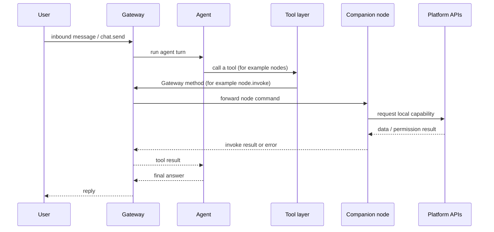
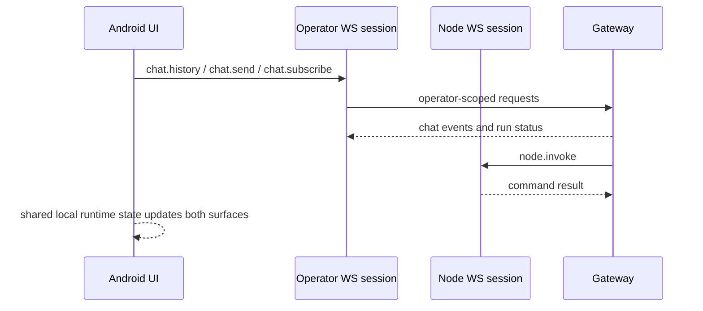
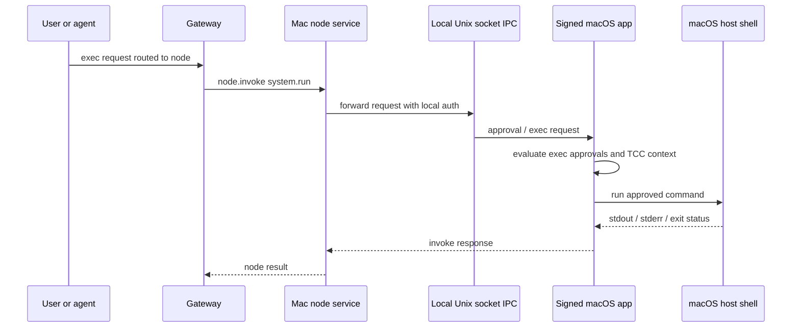
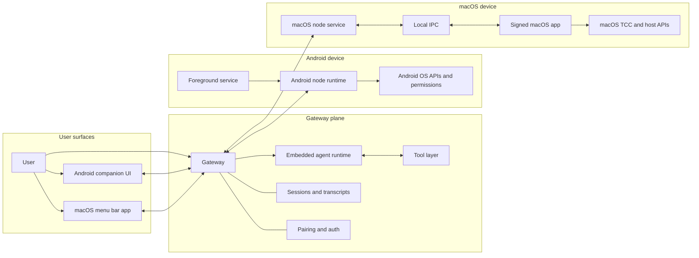
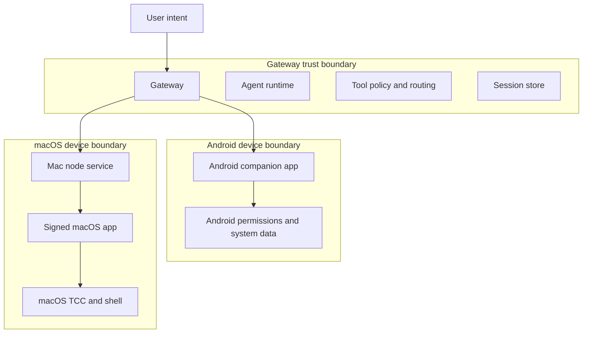

---
read_when:
  - 澄清 macOS 和 Android 配套应用各自负责什么
  - 比较配套应用、Gateway 网关、智能体、节点与工具边界
  - 审查配套应用的能力、权限与信任边界
  - 帮助新贡献者理解配套应用架构
title: 配套应用架构
summary: macOS 与 Android 配套应用架构：角色、能力、权限、信任边界与调用链
x-i18n:
  generated_at: "2026-03-23T00:00:00Z"
  model: gpt-5.2-codex
  provider: openai
  source_hash: fa7af238431ab35f212282df5209300444bcd32e1cd5562cdb3ce588d6ff53f4
  source_path: platforms/companion-architecture.md
  workflow: manual
---

# 配套应用架构

本页是一份面向 **macOS** 与 **Android** 配套应用的 v1 研究摘要。
它的目标是清楚回答 4 个反复出现的问题：

1. 配套应用到底负责什么？
2. 它只是一个 UI 壳，还是同时也承担权限代理、能力代理或节点宿主的角色？
3. macOS 与 Android 之间有哪些共性，又有哪些差异？
4. 哪些配套应用能力属于高风险面？

相关参考：

- [平台](/platforms)
- [macOS 应用](/platforms/macos)
- [Android 应用](/platforms/android)
- [节点](/nodes/index)
- [Gateway 网关协议](/gateway/protocol)
- [智能体运行时](/concepts/agent)
- [macOS IPC](/platforms/mac/xpc)
- [macOS 权限](/platforms/mac/permissions)

## 执行摘要

配套应用**不是**单纯的 UI 壳。

- 在 **Android** 上，配套应用是 **操作员 UI + 节点运行时 + 权限代理 + 能力代理** 的组合体。它会通过 WebSocket 与 Gateway 网关建立两条关系：一条是用于聊天/控制功能的 **operator** 连接，另一条是用于上报设备能力并处理 `node.invoke` 请求的 **node** 连接。
- 在 **macOS** 上，配套应用是 **菜单栏 UI + Gateway 生命周期代理 + 权限代理 + 节点能力宿主**。在本地模式下，它还会管理本地 Gateway 网关生命周期；在远程模式下，它会把这台 Mac 作为远程 Gateway 网关的本地能力端点。它还会通过已签名应用上下文与本地 IPC 来代理 `system.run`。
- 在两个平台上，**Gateway 网关** 仍然是会话、智能体运行、工具路由、配对与策略的系统权威。配套应用**不会**取代 Gateway 网关。
- **智能体** 运行在 Gateway 网关内。智能体调用 **工具**；其中一些工具最终会解析为 **节点** 命令。配套应用只是节点的一种具体实现。

一个便于理解的速记：

- **Gateway 网关** = 权威、会话存储、策略引擎、工具路由器、智能体宿主。
- **智能体** = 运行在 Gateway 网关内部、由模型驱动的决策器。
- **工具** = 可供智能体调用的抽象。
- **节点** = 挂接到 Gateway 网关、可被远程调用的能力宿主。
- **配套应用** = 原生平台应用，同时可能承担 UI、操作员客户端、权限代理与节点实现等角色。

## 核心术语与关系

## Gateway 网关

Gateway 网关是常驻的控制平面。它拥有：

- WebSocket 与 HTTP 入口
- 设备配对与设备签发的认证令牌
- 会话与转录存储
- 智能体执行
- 工具暴露与路由
- 节点注册与 `node.invoke` 转发

Gateway 网关是会话与智能体运行的事实来源。配套应用连接到它，但不会变成它。

## 智能体

智能体是 Gateway 网关为会话运行的内嵌模型运行时。它会：

- 接收会话上下文与系统提示词输入
- 决定是直接回答，还是调用工具
- 通过 Gateway 网关回传工具活动流与最终回复

智能体**不会**运行在 Android 或 macOS 配套应用内部。

## 工具

工具是面向智能体的抽象，例如 `nodes`、`browser`、`exec` 或会话工具。

重要边界：

- 工具的实现**不一定**与 Gateway 网关位于同一台机器上。
- 对于节点支撑的能力，Gateway 网关侧的工具调用会被翻译为诸如 `node.invoke` 之类的 Gateway 方法，再转发给被选中的节点。

## 节点

节点是一个能力宿主，它通过 `role: "node"` 连接到 Gateway 网关，并通告：

- `caps`：高层能力族
- `commands`：可精确调用的命令
- `permissions`：粗粒度的权限状态提示

两个配套应用都分别是其平台上的节点实现。

## 配套应用

配套应用是拥有平台 API 与系统权限的原生端点。

取决于平台，它可能同时是：

- 面向用户的 UI
- 以 `role: "operator"` 连接的操作员客户端
- 以 `role: "node"` 连接的节点
- OS 保护资源的权限代理
- 将节点命令翻译为平台 API 调用的能力代理
- 本地服务或 IPC 的生命周期代理

## 各平台职责

| 领域                        | Android 配套应用                             | macOS 配套应用                                       |
| --------------------------- | -------------------------------------------- | ---------------------------------------------------- |
| 操作员 UI                   | 是                                           | 是                                                   |
| 节点运行时                  | 是                                           | 是                                                   |
| Gateway 宿主                | 否                                           | 有时；本地模式会管理/附加到本地 Gateway 网关         |
| 权限代理                    | 是                                           | 是                                                   |
| 能力代理                    | 是                                           | 是                                                   |
| `system.run` 宿主           | 否                                           | 是                                                   |
| 本地 IPC 代理               | 无额外显著 IPC 层，主要是应用/运行时内部机制 | 是；节点服务 ↔ 应用通过 Unix socket 处理 exec 与审批 |
| 前台服务 / LaunchAgent 管理 | 是；通过前台服务维持节点连接                 | 是；通过 launchd 管理 Gateway 网关与节点服务         |
| 远程模式支持                | 可连接本地或远程 Gateway 网关                | 可连接远程 Gateway 网关，并把本机 Mac 暴露为本地节点 |

## 配套应用不是什么

在两个平台上，配套应用都**不是**：

- 会话转录的事实来源
- 工具暴露的主要策略引擎
- 普通智能体运行的模型宿主
- Gateway 网关的独立替代品

## macOS 与 Android 的共享架构

两个配套应用都遵循同一类顶层模式：

1. 发现或配置一个 Gateway 网关端点
2. 作为设备进行认证与配对
3. 打开一个 **operator** WebSocket 连接，用于 UI/聊天控制
4. 打开一个 **node** WebSocket 连接，用于平台能力
5. 向 Gateway 网关通告能力声明
6. 接收来自 Gateway 网关的 `node.invoke` 请求
7. 将这些请求映射到本地平台 API
8. 返回结果、媒体二进制或结构化错误

共同特征：

- 两者都是**附着在 Gateway 网关上的客户端**，而非独立运行时
- 两者都暴露**节点命令面**
- 两者都拥有各自平台上的 **OS 权限提示**
- 从用户视角看，两者都属于控制平面的一部分
- 两者都可以被 Gateway 网关层面的节点工具查询或驱动

## 关键平台差异

### Android

Android 更像是一个**以移动节点为中心的配套应用**。

- 它永远不会宿主 Gateway 网关。
- 它通过**前台服务**维持节点连接。
- 它暴露更广泛的**个人设备数据**命令，包括通知、照片、联系人、日历、运动、短信与通话记录，具体取决于构建变体、硬件能力与已授予权限。
- 许多交互式媒体能力都要求应用处于**前台**。
- 它会在同一个应用运行时里同时维持 operator 与 node 两类会话。

### macOS

macOS 更像是一个**桌面代理型配套应用**。

- 在本地模式下，它会管理或附加到本地 Gateway 网关。
- 在远程模式下，它会把本地 Mac 能力暴露给远程 Gateway 网关。
- 它拥有一个面向 `system.run` 与 exec 审批的特权桥接层。
- 它还会暴露偏桌面场景的能力，例如屏幕录制与可选的浏览器代理。
- 它在无头节点服务与已签名应用包之间使用专门的本地 IPC 路径，以处理受 TCC 保护的操作。

## 平台能力清单

## Android 配套应用能力族

Android 在可用时会通告以下能力族：

- `canvas`
- `device`
- `notifications`
- `system`
- `camera`
- `sms`
- `voiceWake`（目前在运行时/UX 上基本等于关闭）
- `location`
- `photos`
- `contacts`
- `calendar`
- `motion`
- `callLog`

### Android 节点命令

始终存在或较常见的命令：

- Canvas：`canvas.present`、`canvas.hide`、`canvas.navigate`、`canvas.eval`、`canvas.snapshot`、`canvas.a2ui.push`、`canvas.a2ui.pushJSONL`、`canvas.a2ui.reset`
- Device：`device.status`、`device.info`、`device.permissions`、`device.health`
- Notifications：`notifications.list`、`notifications.actions`
- System：`system.notify`
- Photos：`photos.latest`
- Contacts：`contacts.search`、`contacts.add`
- Calendar：`calendar.events`、`calendar.add`

取决于设置、权限、硬件或构建变体的命令：

- Camera：`camera.list`、`camera.snap`、`camera.clip`
- Location：`location.get`
- Motion：`motion.activity`、`motion.pedometer`
- SMS：`sms.send`、`sms.search`
- Call log：`callLog.search`

Android 的能力暴露是动态的。应用会根据用户设置、构建变体、硬件支持与运行时权限状态来计算当前的命令与能力。

## macOS 配套应用能力族

macOS 在可用时会通告以下能力族：

- `canvas`
- `screen`
- `browser`（可选）
- `camera`（用户开关）
- `location`（用户开关）

macOS 节点还暴露一组系统命令，不过更准确地说，这些命令属于一个特权命令面，而不是单独的能力族：

- `system.run`
- `system.which`
- `system.notify`
- `system.execApprovals.get`
- `system.execApprovals.set`

### macOS 节点命令

始终存在或较常见的命令：

- Canvas：`canvas.present`、`canvas.hide`、`canvas.navigate`、`canvas.eval`、`canvas.snapshot`、`canvas.a2ui.push`、`canvas.a2ui.pushJSONL`、`canvas.a2ui.reset`
- Screen：`screen.record`
- System：`system.notify`、`system.which`、`system.run`、`system.execApprovals.get`、`system.execApprovals.set`

条件性命令：

- Browser proxy：`browser.proxy`
- Camera：`camera.list`、`camera.snap`、`camera.clip`
- Location：`location.get`

macOS 还会上报一个 `permissions` 映射，以便 Gateway 网关与智能体在调用敏感命令前理解当前可用性。

## 权限与系统能力映射

## Android 权限与系统面

| 领域             | 主要 Android 权限或系统门槛                                                | 说明                                |
| ---------------- | -------------------------------------------------------------------------- | ----------------------------------- |
| Gateway 联网     | `INTERNET`、`ACCESS_NETWORK_STATE`                                         | 基础连接能力                        |
| 发现             | 新版 Android 上的 `NEARBY_WIFI_DEVICES`，旧版上依赖位置权限的发现          | 网络发现面                          |
| 前台节点服务     | `FOREGROUND_SERVICE`、`FOREGROUND_SERVICE_DATA_SYNC`、`POST_NOTIFICATIONS` | 用于在可见通知下保持节点连接        |
| 相机照片/视频    | `CAMERA`                                                                   | `camera.snap` 与 `camera.clip` 所需 |
| 带音频的视频录制 | `RECORD_AUDIO`                                                             | 录制带声音的 clip 时需要            |
| 位置             | `ACCESS_FINE_LOCATION`、`ACCESS_COARSE_LOCATION`                           | Android 节点当前支持前台位置模式    |
| 读取/操作通知    | 通知监听服务授权 + 新版 Android 的通知权限                                 | 高敏感度个人数据面                  |
| 照片             | `READ_MEDIA_IMAGES` 或旧版存储权限                                         | 用户媒体访问                        |
| 联系人           | `READ_CONTACTS`、`WRITE_CONTACTS`                                          | 读取与新增联系人                    |
| 日历             | `READ_CALENDAR`、`WRITE_CALENDAR`                                          | 读取与创建事件                      |
| 运动             | `ACTIVITY_RECOGNITION`                                                     | 活动识别与计步能力                  |
| 短信             | `SEND_SMS`、`READ_SMS`                                                     | 在 Google Play 上属于受限权限       |
| 通话记录         | `READ_CALL_LOG`                                                            | 在 Google Play 上属于受限权限       |

## macOS 权限与系统面

| 领域                     | 主要 macOS 门槛                   | 说明                                |
| ------------------------ | --------------------------------- | ----------------------------------- |
| 通知                     | UserNotifications 授权            | 用于原生通知与 `system.notify` 行为 |
| 辅助功能                 | TCC Accessibility                 | 与自动化相关的桌面控制面有关        |
| 屏幕录制                 | TCC Screen Recording              | `screen.record` 与部分捕获流程所需  |
| 麦克风                   | TCC Microphone                    | 语音功能与相机 clip 音频所需        |
| 语音识别                 | TCC Speech Recognition            | 语音唤醒与对话功能所需              |
| 相机                     | TCC Camera                        | `camera.snap` 与 `camera.clip` 所需 |
| 位置                     | Core Location 授权                | `location.get` 所需                 |
| AppleScript / Automation | Apple Events / automation consent | 与应用拥有的自动化能力面相关        |

### 权限代理结论

在两个平台上，配套应用都是**权限代理**，因为它是被操作系统信任、可请求并持有这些授权的代码签名与进程上下文。

这也是为什么不能把配套应用简化为一个薄前端壳。

## 典型调用链

## 调用链 A：智能体使用节点能力

这是 Android 与大多数 macOS 节点能力的标准模式。

解释：

- 配套应用是**能力端点**
- Gateway 网关仍然是**工具路由器与策略权威**
- 智能体不会直接调用平台 API

## 调用链 B：Android 应用同时作为 operator UI 与 node

Android 会在一个应用运行时中同时维持两种 Gateway 网关关系。

解释：

- Android 不只是一个查看器
- 它同时是**控制平面客户端**与**能力宿主**

## 调用链 C：macOS 远程 `system.run`

这是最重要的 macOS 特有调用链。

解释：

- macOS 把配套应用当作**特权执行代理**
- 这比普通能力代理更强，是一个关键的信任边界

## 系统架构图 v1

## 信任边界图 v1

## 信任边界解读

### 边界 1：Gateway 网关 versus 配套应用

Gateway 网关只把节点声明视为**声明**，而不是绝对真实值。它在路由命令前仍会应用服务端策略。

### 边界 2：配套应用 versus 受 OS 保护的资源

当配套应用访问以下内容时，它就跨入了 OS 信任域：

- 相机
- 麦克风
- 位置
- 通知
- 照片
- 联系人
- 日历
- 短信
- 通话记录
- 屏幕录制
- macOS 上的 Shell 执行

这是隐私与数据外传风险最集中的位置。

### 边界 3：macOS 节点服务 versus 已签名应用

在 macOS 上，`system.run` 会被刻意拆分，以避免无头节点服务直接拥有全部高权限行为。面向 TCC 的权威仍然保留在已签名应用里。

## 能力、权限与风险矩阵 v1

| 平台    | 能力             | 代表命令                                                              | 主要权限或门槛                         | 风险     | 原因                                 |
| ------- | ---------------- | --------------------------------------------------------------------- | -------------------------------------- | -------- | ------------------------------------ |
| Android | Canvas           | `canvas.navigate`、`canvas.eval`、`canvas.snapshot`、`canvas.a2ui.*`  | 前台应用状态                           | Medium   | 可暴露屏幕上的数据并启用 UI 状态观察 |
| Android | Camera           | `camera.list`、`camera.snap`、`camera.clip`                           | `CAMERA`，clip 音频还需 `RECORD_AUDIO` | High     | 可拍摄现实环境、文档与音频           |
| Android | Location         | `location.get`                                                        | 粗略/精确位置与前台可用性              | High     | 真实时间的个人位置与移动轨迹         |
| Android | Notifications    | `notifications.list`、`notifications.actions`                         | 通知监听服务                           | High     | 可读取私密入站内容并触发动作         |
| Android | Photos           | `photos.latest`                                                       | 媒体读取权限                           | High     | 暴露个人图片库内容                   |
| Android | Contacts         | `contacts.search`、`contacts.add`                                     | 联系人权限                             | High     | 读取并修改通讯录数据                 |
| Android | Calendar         | `calendar.events`、`calendar.add`                                     | 日历权限                               | High     | 读取日程并创建事件                   |
| Android | Motion           | `motion.activity`、`motion.pedometer`                                 | 活动识别                               | Medium   | 可进行行为画像，但直接外传价值较低   |
| Android | SMS              | `sms.send`、`sms.search`                                              | `SEND_SMS`、`READ_SMS`                 | Critical | 可读取私密消息并向外发送信息         |
| Android | Call log         | `callLog.search`                                                      | `READ_CALL_LOG`                        | High     | 暴露通话历史与关系网络               |
| Android | Device           | `device.status`、`device.info`、`device.permissions`、`device.health` | 基础应用/设备访问                      | Medium   | 设备清单与遥测面                     |
| Android | System notify    | `system.notify`                                                       | 通知发送能力                           | Low      | 基本只是本地通知输出                 |
| macOS   | Canvas           | `canvas.present`、`canvas.eval`、`canvas.snapshot`、`canvas.a2ui.*`   | 应用开关、UI 上下文                    | Medium   | 暴露可见 UI 内容与交互式浏览器状态   |
| macOS   | Browser proxy    | `browser.proxy`                                                       | 应用配置开关、本地控制端点             | High     | 可驱动类似浏览器的动作并返回文件     |
| macOS   | Camera           | `camera.list`、`camera.snap`、`camera.clip`                           | 相机与麦克风 TCC                       | High     | 可捕获环境与可选音频                 |
| macOS   | Location         | `location.get`                                                        | 位置授权                               | High     | 敏感的物理位置信息                   |
| macOS   | Screen           | `screen.record`                                                       | 屏幕录制 TCC                           | Critical | 可捕获密码、消息与工作内容           |
| macOS   | System notify    | `system.notify`                                                       | 通知权限状态                           | Low      | 仅本地输出                           |
| macOS   | System discovery | `system.which`                                                        | Exec 策略                              | Medium   | 可用于侦察宿主机能力                 |
| macOS   | System execution | `system.run`                                                          | Exec 审批、本地 IPC、宿主 Shell        | Critical | 在 Mac 上执行任意命令                |
| macOS   | Exec approvals   | `system.execApprovals.get`、`system.execApprovals.set`                | 本地审批存储                           | Critical | 可改变后续执行的信任策略             |

## 高风险能力短名单

这些能力面最值得投入设计审查、审批加固与操作员可见性。

### Critical

- Android `sms.send`
- Android `sms.search`
- macOS `screen.record`
- macOS `system.run`
- macOS `system.execApprovals.set`

### High

- Android 的通知访问与通知动作
- Android 的照片、联系人、日历、位置、通话记录
- Android 的相机与麦克风采集
- macOS 的浏览器代理
- macOS 的相机与位置

### 容易被低估但属于 Medium

- Canvas 快照与类浏览器能力面
- 设备元数据与健康清单
- 运动历史或行为遥测
- macOS 上可用于宿主机侦察的 `system.which`

## 设计结论

## 1）配套应用职责

配套应用的职责，是把 Gateway 网关抽象的智能体/工具世界桥接到真实的平台能力。

这意味着它需要承担：

- 提供原生 UI
- 建立 Gateway 网关连接
- 作为设备完成认证与配对
- 持有 OS 权限提示与授权
- 通告节点能力声明
- 代表本地平台 API 执行节点命令
- 返回结构化结果与错误

## 2）UI 壳、代理还是节点宿主

最准确的答案是：

- **Android 配套应用** = UI 壳 **加上** 权限代理 **加上** 能力代理 **加上** 节点运行时
- **macOS 配套应用** = UI 壳 **加上** Gateway 生命周期代理 **加上** 权限代理 **加上** 节点能力宿主 **加上** 特权 exec 代理

所以无论在哪个平台，配套应用都**远不止是一个 UI 壳**。

## 3）共性与差异

共性：

- 两者都是连接到 Gateway 网关的原生客户端
- 两者都暴露节点能力
- 两者都拥有权限授予 UX
- 两者都会被智能体通过 Gateway 网关工具路由间接使用

差异：

- Android 以**移动设备数据与传感器**为中心
- macOS 以**桌面控制、屏幕捕获与本地命令执行**为中心
- macOS 还可以管理或附加到 Gateway 网关本体；Android 不可以

## 4）安全姿态含义

真正的高风险问题不是“这个配套应用有没有 UI？”。
更关键的问题是：“Gateway 网关可以在什么策略下、通过什么审批、以何种用户可见性，把哪些本地能力路由进这台设备？”

这才是审查配套应用变更时应该采用的正确视角。
